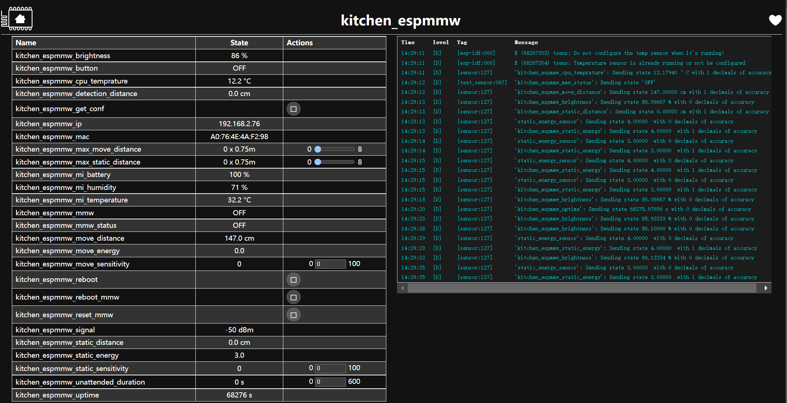
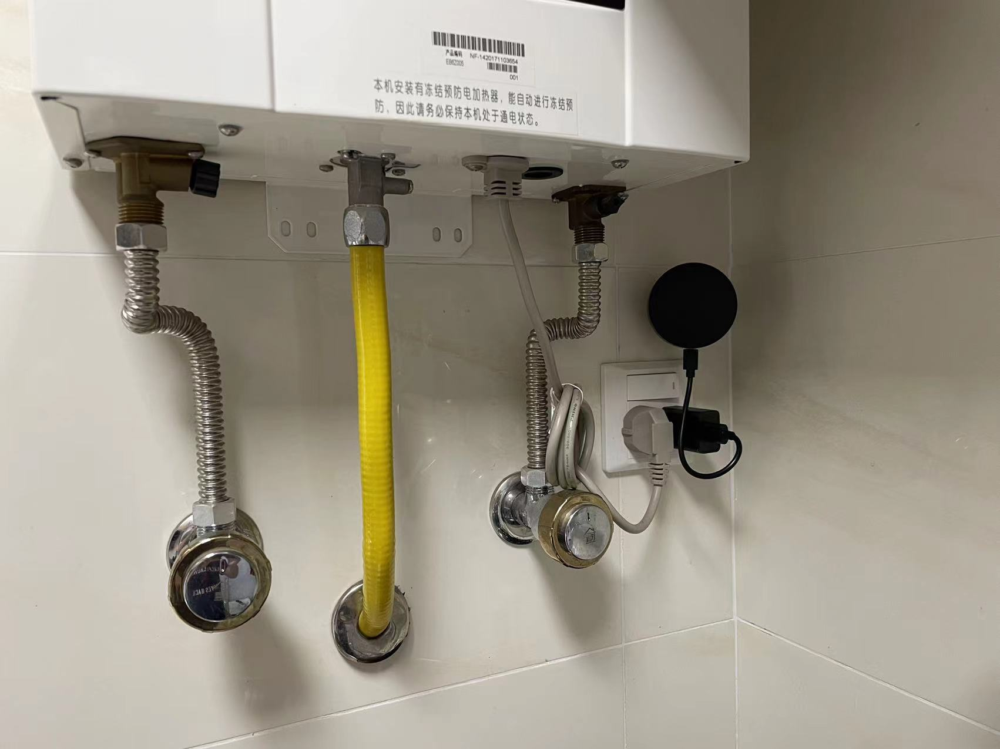

# ESPMMW

## `简介`


### 讨论群： `810581215`

最近毫米波很火，正好模块价格也下来了，群友介绍购买了海凌科 `LD2410` 的毫米波模块，参与了早期测试版本。在 `1688` 找到了一个相对完美的[红外遥控外壳](https://detail.1688.com/offer/653134990795.html)，稍加修改之前[S6in1](https://github.com/liwei19920307/S6in1)的项目，画了 `PCB` 测试。为了实现 `LD2410` 串口相关功能，找到了一个外国大佬的[帖子](https://community.home-assistant.io/t/mmwave-presence-detection-esphome-style/382778)，啃了两天 `C++`基础，搞出了相对完美的 `ESPHOME`
固件。因为很忙，都是抽空搞的，整个项目总共花了两个月。`PCB` 测试样品花了一些时间，固件编写也花了几天时间，更多的时间都是用来测试毫米波稳定性，稳定性这里要感谢我的硬件大佬朋友孔老板的指导

### 雷达特点：

- 外观精致
- 支持磁吸底座
- 多功能：人体存在，距离调节，呼吸检测，环境亮度，红外遥控（支持收发，但暂时不能同时使用，`ESPHOME` 的 `BUG`），蓝牙网关（测试过[米家低功耗](https://esphome.io/components/sensor/xiaomi_ble.html)）
- 方便二次开发：`TYPE-C` 接口，支持串口调试（[USB Serial/JTAG](https://docs.espressif.com/projects/esp-idf/en/latest/esp32c3/api-guides/usb-serial-jtag-console.html)）
- 成本低廉（总体硬件成本 `50` 左右）
- 稳定性极好
- 主控 `ESP32C3`

### 固件特点：

- 支持运动、静止状态显示
- 检测距离显示
- 动静距离显示，能量显示
- 动静灵敏度调节
- 动静距离调节
- `ESP32` 状态显示（`IP，MAC，CPU` 温度，运行时间）

## `GPIO`

| GPIO | 功能           |
| ---- | -------------- |
| 0    | 红外接收       |
| 1    | 红外发射       |
| 2    | 背部自定义按键 |
| 3    | 光敏电阻电压   |
| 5、6 | 毫米波串口     |
| 8    | 毫米波状态     |

## `ESPHOME`

默认配置在 `ESPHOME` 文件夹，其中 `LD2410.h` 是串口适配程序，以下是一些额外功能的例子

注意红外收发不能同时使用，希望 `ESPHOME` 能解决

红外接收（`ESPHOME` 的 `BUG` 需要先定义一个假的接收服务 `GIPIO10`，和 `RMT` 有关）

```yaml
remote_receiver:
  - id: ${device_name}_null
    pin:
      number: 10
      inverted: true
    dump: raw
  - id: ${device_name}_rr
    pin:
      number: 0
    dump: raw
```

红外发射

```yaml
remote_transmitter:
  pin: 1
  carrier_duty_percent: 50%
```

蓝牙

参考[ESPHOME](https://esphome.io/components/esp32_ble_tracker.html)



| 组件                       | 含义                                                          |
| -------------------------- | ------------------------------------------------------------- |
| espmmw_brightness          | 环境亮度                                                      |
| espmmw_button              | 毫米波背后按钮                                                |
| espmmw_cpu_temprature      | CPU 温度                                                      |
| espmmw_detection_distance  | 检测距离                                                      |
| espmmw_get_conf            | 获取当前毫米波配置                                            |
| espmmw_ip                  | IP                                                            |
| espmmw_mac                 | MAC                                                           |
| espmmw_max_move_distance   | 最大移动距离调节（最大距离=n\*0.75 米）                       |
| espmmw_max_static_distance | 最大静止距离调节 （最大距离=n\*0.75 米）                      |
| espmmw_mmw                 | 毫米波状态                                                    |
| espmmw_mmw_status          | 毫米波状态（OFF-关闭，MOVE-运动，STATIC-静止，ON 运动或静止） |
| espmmw_move_distance       | 当前运动距离                                                  |
| espmmw_move_energy         | 当前运动能量                                                  |
| espmmw_move_sensitivity    | 移动灵敏度调节                                                |
| espmmw_reboot              | 重启 esp                                                      |
| espmmw_reboot_mmw          | 重启毫米波                                                    |
| espmmw_reset_mmw           | 重置毫米波                                                    |
| espmmw_signal              | WiFi 信号强度                                                 |
| espmmw_static_distance     | 当前静止距离                                                  |
| espmmw_static_energy       | 当前静止能量                                                  |
| espmmw_static_sensitivity  | 静止灵敏度调节                                                |
| espmmw_unattended_duration | 无人值守时间调节                                              |
| espmmw_uptime              | 运行时间                                                      |

## `教程`

- 编译和刷机

  `Linux` （ 以下是在 `x86` 的 `Ubuntu` 下操作的，其他 `Linux` 类似，不支持 `ARM` ）

  1、[安装 docker 及 docker-compose](https://www.bilibili.com/video/BV1vv4y1c7iQ/)

  2、`docker-compose.yml` 文件增加如下内容

  ```yml
  version: "3"
    services:

      esphome:
        image: esphome/esphome:2022.8.0
        container_name: esphome
        volumes:
          - /etc/localtime:/etc/localtime:ro
          - /opt/esphome/conf:/config
          - /dev:/dev
        environment:
          - TZ=Asia/Shanghai
        network_mode: host
        restart: always
        privileged: true
  ```

  3、安装 `esphome` 的 `docker`

  ```
  docker-compose -f docker-compose.yml up -d
  ```

  4、打开 `esphome` 的页面 `http://IP:6052`，新增 `espmmw` 的配置文件，编辑配置文件删除全部，将文件夹[esphme](https://github.com/liwei19920307/ESPMMW/tree/main/esphome)的配置粘贴上去，按需修改后保存

  5、`docker` 服务器执行如下命令进入 `esphome` 的 `docker` 内部

  ```
  docker exec -it esphome bash
  ```

  6、设置 https 代理（这部比较重要，编译需要从`git`下载依赖）

  ```
  export https_proxy=http://IP:PORT
  ```

  7、将毫米波通过数据线插入服务器

  8、执行编译并刷入

  ```
  esphome run espmmw.yaml
  ```

  `Windows`

  将编译的固件放入[flash_tool](https://github.com/liwei19920307/ESPMMW/tree/main/flash_tool)，按说明操作

## `问题`

- `LD2410` 的芯片固件还是有一点问题，发送串口命令容易死机，这个需要官方提供固件优化，但串口接收很稳定不影响实际使用

- `LD2410` 的发热很多人觉得温度很高，温度确实比较高，但实际并不影响使用，我已经用了两个月没发现有什么问题

- 红外无法同时使用，硬件并没有问题，`ESPHOME` 的锅，希望有大佬能看到并解决主要应该是 `ESP32C3 RMT` 兼容的问题

## `关于开源`

- 这次 `DIY` 是目前花的时间和精力最多的一次，所以暂时只开放软件部分，硬件部分的开源会在后期更新，大家也可以参考我其他项目[S6in1](https://github.com/liwei19920307/S6in1)，和这个[红外遥控外壳](https://detail.1688.com/offer/653134990795.html)自行 `DIY`，时间精力花了不少希望大家理解

- ！！！转载请注明出处 ！！！

## `购买`

[淘宝](https://item.taobao.com/item.htm?id=677669621322)

默认包含雷达和一根数据线，不含充电器

配件可以根据需求自行购买，强烈推荐磁吸底座，数据线长度随机发

由于还有工作，都是抽空 `DIY`，所以发货时间不能保证，但会尽快，希望理解

## `细节`


## `场景`



